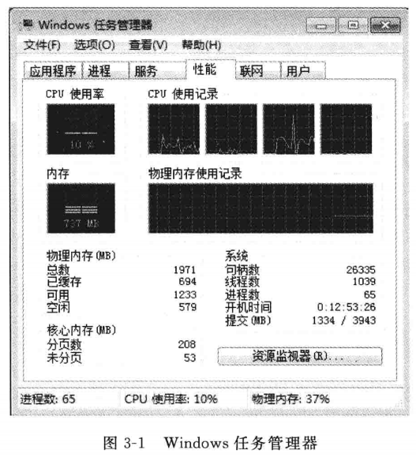
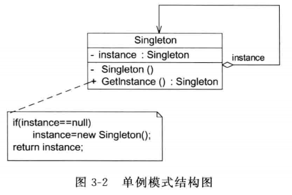
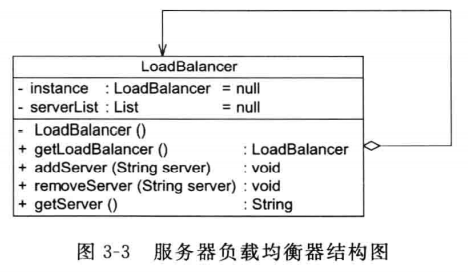
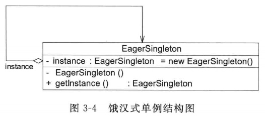
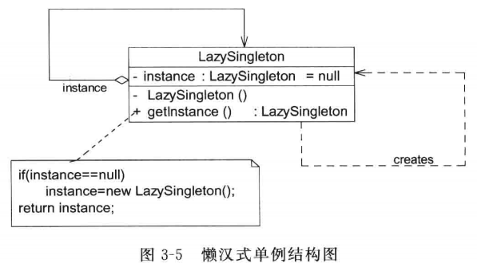

# 简介

《设计模式的艺术：软件开发人员内功修炼之道》

# 3 确保对象的唯一性 – 单例模式

## 3.1 单例模式的动机

## 3.2 单例模式概述

> 单例模式（Singleton Pattern）：
>
> 确保某一个类只有一个实例，而且自行实例化并且向整个系统提供这个实例，这个类成为单例类，它提供全局访问的方法。单例模式是一种对象创建型模式。

## 3.3 负载均衡器的设计

## 3.4 饿汉式单例与懒汉式单例的讨论

1. 饿汉式单例类

2. 懒汉式单例类与线程锁定

3. 饿汉式单例类与懒汉式单例类比较

## 总结

### 优点

1. 单例模式提供了对唯一实例的受控访问。因为单例类封装了它的唯一实例，所以它可以严格控制客户怎样以及何时访问它
2. 由于在系统内存中只存在一个对象，因此可以节约系统资源，对于一些需要频繁创建和销毁的对象，单例模式无疑可以提高系统的性能
3. 允许可变数目的实例。基于单例模式，开发人员可以进行扩展，使用与控制单例对象相似的方法来获得指定个数的实例对象，既节省系统资源，又解决了由于单例对象共享过多有损性能的问题

### 缺点

1. 没有抽象层，因此单例类的扩展有很大的困难
2. 单例类的职责过重，在一定程度上违背了单一职责原则。因为单例类及提供了业务方法，又提供了创建对象的方法，将对象的创建和对象本身的功能耦合在一起
3. 现在很多面向对象语言的运行环境都提供了自动垃圾回收技术，因此，如果实例化的共享对象长时间不被利用，系统会认为他是垃圾，会自动销毁并回收资源，瑕疵利用时又将重新实例化，这将导致共享的单例对象状态丢失

### 场景

1. 系统只需要一个实例对象。如，系统要求提供一个唯一的序列号生成器或资源管理器，或者需要考虑资源消耗太大而只允许创建一个对象
2. 客户调用类的单个实例只允许使用一个公共访问点，除了该公共访问点，不能通过其他途径访问该实例

# 4 集中式工厂的实现 – 简单工厂模式

## 4.2 简单工厂模式概述

> 简单工厂模式（Simple Factory Pattern）：
>
> 定义一个工厂类，它可以根据参数的不同返回不同类的实例，被创建的实例通常都具有共同的父类。因为在简单工厂模式中用于创建实例的方法是静态方法，因此简单工厂模式又被称为**静态工厂方法（Static Factory Method）模式**，属于类创建型模式。

## 4.3 完整解决方案

## 4.5 创建对象与使用对象

## 4.6 简单工厂模式的简化

## 总结

提供了专门的工厂类用于创建对象，将对象的创建和对象的使用分离开。

### 优点

1. 工厂类包含必要的判断逻辑，可以决定在什么时候创建哪一个产品累的示例，客户端可以免除直接创建产品对象的职责，而仅仅“消费”产品。简单工厂模式实现了对象创建和使用的分离
2. 客户端无需知道所创建的具体产品类的类名，只需要知道具体产品类所对应的参数即可，对于一些复杂的类型，通过简单工厂模式可以在一定程度减少使用者的记忆量
3. 通过引入配置文件，可以在不修改任何客户端代码的情况下更换和增加新的具体产品类，在一定程度上提高了系统的灵活性

### 缺点

1. 由于工厂类集中了所有产品的创建逻辑，职责过重，一单不能正常工作，整个系统都要受到影响
2. 使用简单工厂模式势必会增加系统中累的个数（引入了新的工厂类），增加了系统的复杂度和理解难度
3. 系统扩展困难，一单添加新产品就不得不修改工厂逻辑，在产品类型较多时，有可能造成工厂逻辑过于复杂，不利于系统的扩展和维护
4. 简单工厂模式由于使用了静态工厂方法，造成工厂角色无法形成基于继承的等级结构

### 场景

1. 工厂类复杂创建的对象比较少，由于创建的对象较少，不会造成工厂方法中的业务逻辑太过复杂
2. 客户端只知道传入工厂类的参数，对于如何创建对象并不关心

# 5 多态工厂的实现 – 工厂方法模式

## 5.1 日志记录器的设计

## 5.2 工厂方法模式概述

> **工厂方法模式（Factory Method Pattern）**：
>
> 定义一个用于创建对象的接口，让子类决定将哪一个类实例化。工厂方法模式让一个类的实例化延迟到子类。工厂方法模式又简称为**工厂模式（Factory Pattern）**，又可称作**虚拟构造器模式（Virtual Constructor Pattern）**或**多态工厂模式（Polymorphic Factory Pattern）**。工厂方法模式是一种类创建型模式。

## 5.3 完整解决方案

## 5.5 重载的工厂方法

## 5.6 工厂方法的隐藏

## 总结

工厂方法模式是简单工厂模式的延伸，继承了简单工厂模式的优点，同时弥补了简单工厂模式的不足。

### 优点

1. 工厂方法用来创建客户所需要的产品，同时还向客户隐藏了哪种具体产品类将被实例化这一细节，用户只需要关心所需产品对应的工厂，无需关心创建细节，甚至无需知道具体产品类的类名
2. 基于工厂角色和产品角色的多态性设计时工厂方法模式的关键。它能够让工厂可以以自主确定创建何种产品对象，而如何创建这个对象的细节则完全封装在具体工厂内部。工厂方法模式只所以又被称为多态工厂模式，正是因为所有的具体工厂类都具有统一抽象父类
3. 使用工厂方法模式的另一个优点是在系统中加入新产品时，无需修改抽象工厂和抽象产品提供的接口，无需修改客户端，也无需修改其它的具体工厂和具体产品，而只要添加一个具体工厂和具体产品就可以了。这样，系统的可扩展性也就变得非常好，完全符合开闭原则

### 缺点

1. 在添加新产品时，需要编写新的具体产品类，而且还要提供与之对应的具体工厂类，系统中类的个数将成对增加，在一定程度上增加了系统的复杂度，有更多的类需要编译和运行，会给系统带来一些额外的开销
2. 由于考虑到系统的可扩展性，需要引入抽象层，在客户端代码中均使用抽象层进行定义，增加了系统的抽象性和裂解难度，且在实现时可能需要用到 DOM、反射等技术，增加了系统的实现难度

### 场景

1. 客户端不知道其所需要的的对象的类。在工厂方法模式中，客户端不需要知道具体产品类的类型，只需要知道所对应的工厂即可，具体的产品对象由具体工厂类创建，可将具体工厂类的类名存储在配置文件或数据库中
2. 抽象工厂类通过其子类来指定创建哪个对象。在工厂方法模式中，抽象工厂类只需要提供一个创建产品的接口，而由其子类来确定具体要创建的对象，利用面向对象的多态性和里氏替换原则，在程序运行时，子类对象将覆盖父类对象，从而使用系统更容易扩展

# 6 产品族的创建 – 抽象工厂模式

## 6.1 界面皮肤库的初始设计

## 6.2 产品等级结构与产品族

## 6.3 抽象工厂模式概述

> 抽象工厂模式（Abstract Factory Pattern）：
>
> 提供一个创建一系列相关或相互依赖对象的接口，而无需指定它们具体的类。抽象工厂模式又称为 Kit 模式，它是一种对象创建型模式。

## 6.4 完整解决方案

## 总结

### 优点

1. 隔离了具体类的生成，使得客户并不需要知道什么被创建。由于这种隔离，更换一个具体工厂就变得相对容易，所有的具体工厂都实现了在抽象工厂中声明的那些公共接口，因此只需改变具体工厂的实例，就可以在某种程度上改变整个软件系统的行为
2. 当一个产品族中的多个对象呗设计成一起工作时，它能够保证客户端始终只使用同一个产品族中的对象
3. 增加新的产品族很方便，无需修改已有系统，符合开闭原则

### 缺点

增加新的产品登记结构麻烦，需要对原有系统进行较大的修改，甚至需要修改抽象层代码，违背了开闭原则。

### 场景

1. 一个系统不应当依赖于产品类实例如何被创建、组合和表达的细节，这对于所有类型的工厂模式都是很重要的，用户无需关心对象的创建过程，将对象的创建和使用解耦
2. 系统中有多于一个的产品族，而每次只使用其中某一产品族。可以通过配置文件等方式来使得用户可以动态改变产品族，也可以很方便地增加新的产品族
3. 属于同一个产品族的产品将在一起使用，这一约束必须在系统的设计中体现出来。同一个产品族中的产品可以是没有任何关系的对象，但是它们都具有一些共同的约束。例如统一操作系统下的按钮和文本框，按钮与文本框之间没有直接关系，但它们都是属于某一操作系统的，此时具有一个共同的约束条件：操作系统的类型
4. 产品等级结构稳定，设计完成之后，不会向系统中增加新的产品等级结构或者删除已有的产品等级结构

# 7 对象的克隆– 原型模式

## 7.1 大同小异的工作周报

## 7.2 原型模式概述

> 原型模式（Prototype Pattern）：
>
> 使用原型实例指定创建对象的种类，并且通过克隆这些原型创建新的对象。原型模式是一种对象创建型模式。

## 7.3 完整解决方案

## 7.4 带附件的周报

1. 浅克隆

2. 深克隆

   

## 7.5 原型管理器的引入和实现

## 总结

作为一种快速创建大量相同或相似对象的方式。

### 优点

1. 当创建新的对象实例较为复杂时，使用原型模式可以简化对象的创建过程，通过复制一个已有实例可以提高新实例的创建效率
2. 扩展性较好。由于在原型模式中提供了抽象原型类，在客户端可以针对抽象原型类进行编程，而将具体原型类写在配置文件中，增加或减少具体原型类对原有系统都没有任何影响
3. 原型模式提供了简化的创建结构。工厂方法模式常常需要有一个与产品类等级结构相同的等级结构，而原型模式就不需要这样，原型模式中产品的赋值是通过封装在原型类中的克隆方法实现的，无需专门的工厂类来创建产品。
4. 可以使用深克隆的方式保存对象的状态。使用原型模式将对象复制一份并将其状态保存起来，以便在需要的时候使用，例如恢复到某一历史状态，可以辅助实现撤销操作

### 缺点

1. 需要为每一个类配备一个克隆方法，而且该克隆方法位于一个类的内部，当对已有的类进行改造时，需要修改源代码，违背了开闭原则
2. 在实现深克隆时需要编写较为复杂的代码，而且当对象之间存在多重的嵌套引用时，为了实现深克隆，每一层对象对应的类都必须支持深克隆，实现起来可能会比较麻烦

### 场景

1. 创建新对象成本较大（例如初始化需要占用较长的时间，占用太多的 CPU 资源或网络资源），新的对象可以通过原型模式对已有对象进行复制来获得，如果是相似对象，则可以对其成员变量稍作修改
2. 如果系统要保存对象的状态，而对象的状态变化很小，或者对象本身占用内存较少时，可以使用原型模式配合备忘录模式来实现
3. 需要避免使用分层次的工厂类来创建分层次的对象，并且类的实例对象只有一个或很少的几个组合状态，通过复制原型对象得到新实例可能比使用构造函数创建一个新实例更加方便

# 17 请求发送者与接收者解耦 – 命令模式

## 17.2 命令模式概述

## 17.3 完整解决方案

## 17.5 撤销操作的实现

## 17.6 请求日志

## 17.7 宏命令

## 总结

可以将请求发送者与接收者解耦，请求发送者通过命令对象来间接引用请求接收者，使得系统具有更好的灵活性和可扩展性。

### 优点

1. 降低系统的耦合度。由于请求者与接收者之间不存在直接饮用，因此请求者与接收者之间实现完全解耦，相同的请求者可以对应不同的接收者，同样，相同的接收者也可以供不同的请求者使用，两者之间具有良好的独立性
2. 新的命令可以很容易地加入系统中。由于增加新的具体命令类不会影响到其它类，因此增加新的具体命令类很容易，须发修改原有系统源代码甚至客户类代码，满足开闭原则的要求
3. 可以比较容易地设计一个命令队列或宏命令（组合命令）
4. 为请求的撤销（Undo）和恢复（Redo）操作提供了一种设计和实现方案

### 缺点

可能导致系统有过多的具体命令类。因为针对每一个对请求接收者的调用操作都需要设计一个具体命令类，因此在某些系统中可能需要提供大量的具体命令类。

### 场景

1. 系统需要将请求调用者和请求接收者解耦，使得调用者和接收者不直接交互。请求调用者无需知道接收者的存在，也无需知道接收者是谁，接收者也无需关心何时被调用
2. 系统需要在不同的时间指定请求、将请求排队和执行请求。一个命令对象和请求的初始调用者可以有不同的生命期，换言之，最初的请求发出者可能已经不在了，而命令对象本身仍然是活动的，可以通过该命令对象去调用请求接收者，而无需关心请求调用者的存在性，可以通过请求日志文件等机制来具体实现
3. 系统需要支持命令的撤销（Undo）操作何恢复（Redo）操作
4. 系统需要将一组操作组合在一起形成宏命令

# 23 对象状态及其转换 – 状态模式

## 23.1 银行系统中的账户类设计

## 23.2 状态模式概述

## 23.3 完整解决方案

## 23.4 共享状态

## 23.5 使用环境类实现状态转换

## 总结

将一个对象在不同状态下的不同行为封装在一个个状态中，通过设置不同的状态对象可以让对象拥有不同的行为，而状态转换的细节对于客户端而言是透明的，方便了客户端的使用。

### 优点

1. 封装了状态的转换规则，在状态模式中可以将状态的转换代码封装在环境类或者具体状态类中，可以对状态转换代码进行集中管理，而不是分散在一个个业务方法中、
2. 将所有与某个状态有关的行为放到了一个类中，只需要注入一个不同的状态对象即可使环境对象拥有不同的行为
3. 允许状态转换逻辑与状态对象合成一体，而不是提供一个巨大的条件语句块，可以避免使用庞大的条件语句来将业务方法和状态转换代码交织在一起
4. 可以让多个环境对象共享一个状态对象，从而减少系统中对象的个数

### 缺点

1. 会增加系统中类和对象的个数，导致系统运行开销增大
2. 对开闭原则的支持不太好，增加新的状态类需要修改那些负责状态转换的源代码，否则无法转换到新增状态；而且修改某个状态类的行为也需要修改对应类的源代码

### 场景

1. 对象的行为依赖于它的状态（例如某些属性值），状态的改变将导致行为的变化
2. 在代码中包含大量与对象状态有关的条件语句，这些条件语句的出现，会导致代码的可维护性和灵活性变差，不能方便地增加和删除状态，并且导致客户类与类库之间的耦合增强

# 25 定义算法的框架 – 模板方法模式

## 25.2 模板方法模式概述

> 模板方法模式（Template Method Pattern）：定义一个操作中算法的框架，而将一些步骤延迟到子类中，模板方法使得子类可以不改变一个算法的结构即可重定义改算法的某些特定步骤。模板方法是一种类行为模式。

## 25.3 完整解决方案

## 25.4 钩子方法的使用

## 总结

模板方法模式是一种基于继承的代码复用技术，通过父类来控制处理流程的逻辑顺序（如框架的初始化、测试流程的设置等）。

### 优点

1. 在父类中形式化地定义一个算法，而由它的子类来实现细节的处理，在子类实现详细的处理算法时并不会改变算法中步骤的执行次序
2. 是一种代码复用技术，将公共行为放在父类中，而通过其子类来实现不同的行为，鼓励恰当使用继承来实现代码复用
3. 可实现一种反向控制结构，通过子类覆盖父类的狗子方法来决定某一特定步骤是否需要执行
4. 通过子类来覆盖父类的基本方法，不同的子类可以提供基本方法的不同实现，更换和增加新的子类很方便，符合单一职责原则和开闭原则

### 缺点

需要为每一个基本方法的不同实现提供一个子类，如果父类中可变的基本方法太多，将会导致类的个数增加，系统更加庞大，设计也更加抽象，此时，可以结合桥接模式来进行设计。

### 场景

1. 对一些复杂的算法进行分割，将其算法中固定不变的部分设计为模板方法和父类具体方法，而一些可以改变的细节由子类来实现。即一次性地实现一个算法的不变部分，并将可变的行为留给子类来实现
2. 各子类中的公共的行为应被提取出来并集中到一个公共父类中以避免代码重复
3. 需要通过子类来决定父类算法中某个步骤是否执行，实现子类对父类的反向控制
